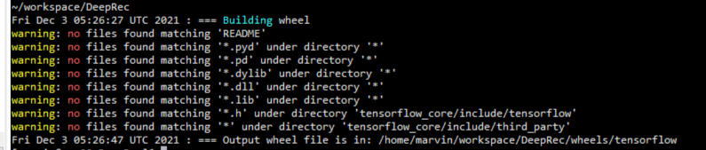
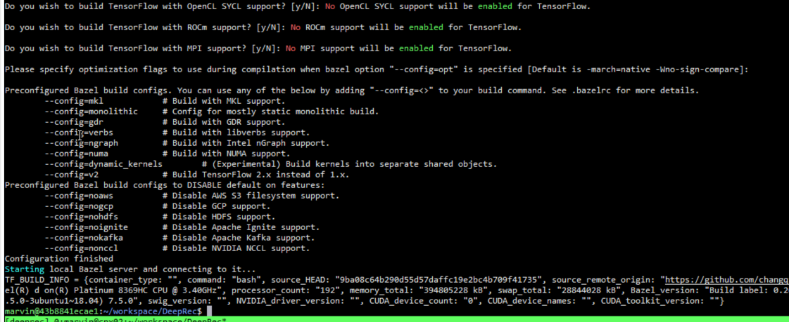

# Jarvis

Jarvis contains all the DeepRec CI scripts and tools, which are widely using at operator unit test, operator benchmark and reco models perfs in DeepRec.

## Manual Develop environment setup
### Prerequisite
1. Install [docker](https://docs.docker.com/engine/install/) in your test environment.
2. Clone this repo under your workspace.
```bash
git clone https://github.com/changqi1/DeepRec.git
```

## Usages
### How to build DeepRec package?
#### - Using Jarvis script build directly.
``` bash
# move into DeepRec folder
$ cd DeepRec/
# start build DeepRec package
$ ./ci_build bazel_build cpu
```

Now you can get your package at `ls $PWD/wheels/tensorflow/*`

#### - Login to Jarvis container and build package by `bazel`.
Building container which have all the develop dependency and move workspace into container.
``` bash
$ export CI_DOCKER_EXTRA_PARAMS=-it
$ ./ci_build bash
```
Or using the command as below. Both of all can get same result.
``` bash
$ CI_DOCKER_EXTRA_PARAMS=-it ./ci_build bash
```
Some logs information can show your develop device configuration.

Then, Building the DeepRec package. You can refer to the following build steps.
``` bash
# Set the compile option as you want.
$ default_opt="--cxxopt=-D_GLIBCXX_USE_CXX11_ABI=0 \
               --copt=-O3 --copt=-Wformat --copt=-Wformat-security \
               --copt=-fstack-protector --copt=-fPIC --copt=-fpic \
               --linkopt=-znoexecstack --linkopt=-zrelro \
               --linkopt=-znow --linkopt=-fstack-protector \
               --copt=-Wno-sign-compare"
$ intel_opt="--config=mkl_threadpool \
             --define build_with_mkl_dnn_v1_only=true \
             --copt=-DENABLE_INTEL_MKL_BFLOAT16 \
             --copt=-march=skylake-avx512"

# Building the DeepRec package.
$ bazel build $default_opt $intel_opt //tensorflow/tools/pip_package:build_pip_package
$ ./bazel-bin/tensorflow/tools/pip_package/build_pip_package .
```

### How to do unit test in DeepRec?

#### - Basic UT requirement
``` bash
# move into DeepRec folder
$ cd DeepRec/
# basic unit test
$ ./ci_build cibuild/cpu-ut.sh
```
#### - MKL-related UT requirement
``` bash
# move into DeepRec folder
$ cd DeepRec/
# basic unit test
$ ./ci_build bazel_build UT
```

#### - Test your unit test in custom Op.
``` bash
# move into DeepRec folder
$ cd DeepRec/
# start test contianer
$ CI_DOCKER_EXTRA_PARAMS=-it ./ci_build bash

# Set the compile option.
$ default_opt="--cxxopt=-D_GLIBCXX_USE_CXX11_ABI=0 \
               --copt=-O3 --copt=-Wformat --copt=-Wformat-security \
               --copt=-fstack-protector --copt=-fPIC \
               --copt=-fpic --linkopt=-znoexecstack --linkopt=-zrelro \
               --linkopt=-znow --linkopt=-fstack-protector \
               --copt=-Wno-sign-compare  \
               --test_size_filters=small,medium,large,enormous \
               --keep_going"

$ intel_opt="--config=mkl_threadpool \
             --define build_with_mkl_dnn_v1_only=true \
             --copt=-DENABLE_INTEL_MKL_BFLOAT16 \
             --copt=-march=skylake-avx512"

$ UT_opt="--test_output=all --nocache_test_results"

# your UT target, such as
$ test_name="//tensorflow/core/kernels:mkl_matmul_op_test"
$ bazel test $UT_opt $default_opt $intel_opt $test_name
```

### How to get Ops performance?
```bash
# move into DeepRec folder
$ cd DeepRec/
# start test contianer
$ CI_DOCKER_EXTRA_PARAMS=-it ./ci_build bash

$ default_opt="--cxxopt=-D_GLIBCXX_USE_CXX11_ABI=0 \
               --copt=-O2 --copt=-Wformat --copt=-Wformat-security \
               --copt=-fstack-protector --copt=-fPIC \
               --copt=-fpic --linkopt=-znoexecstack --linkopt=-zrelro \
               --linkopt=-znow --linkopt=-fstack-protector \
               --copt=-Wno-sign-compare  \
               --test_size_filters=small,medium,large,enormous \
               --test_verbose_timeout_warnings \
               --flaky_test_attempts 1 \
               --test_timeout 99999999 \
               --keep_going"

$ intel_opt="--config=mkl_threadpool \
             --define build_with_mkl_dnn_v1_only=true \
             --copt=-DENABLE_INTEL_MKL_BFLOAT16 \
             --copt=-march=skylake-avx512"

$ BM_opt="--test_output=all --nocache_test_results --test_arg=--benchmarks=all"

$ test_name="//tensorflow/core/kernels:mkl_fused_batch_norm_op_test"
$ bazel test $BM_opt $default_opt $intel_opt $test_name
```

### How to get Modelzoo performance?
For the introduce of getting DeepRec modelzoo performance please follow https://github.com/intel-sandbox/cesg.alibaba.deeprec.modelzoo.benchmark


## Internal sub-task reference -- WIP
- [Units test requirement](docs/Unit-test.md)
    
- [Benchmark test requirement](docs/Benchmark-test.md)

## Reference
- Bazel: https://docs.bazel.build/versions/0.26.0/user-manual.html
- Github Action: https://docs.github.com/en/actions