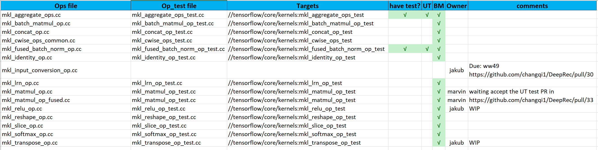
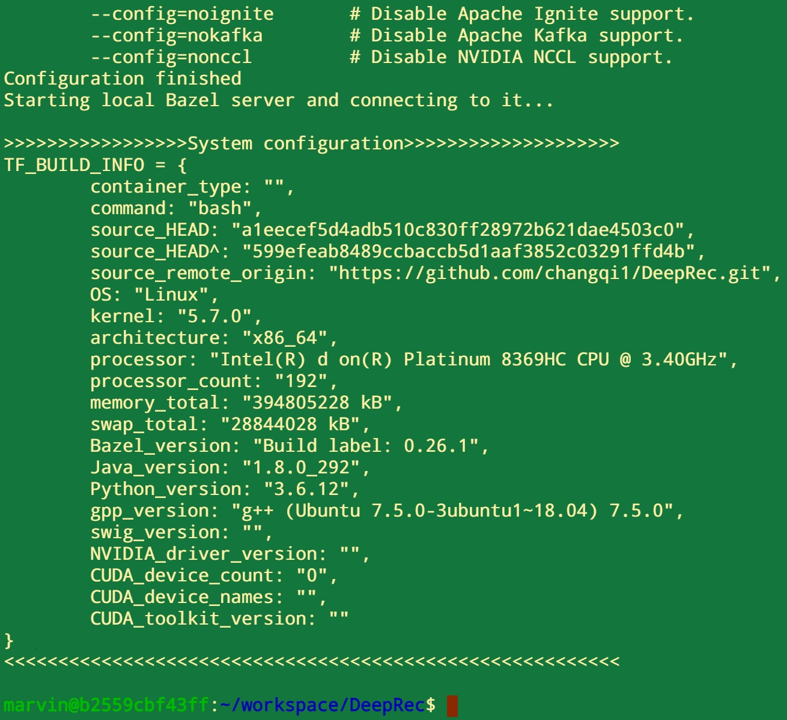
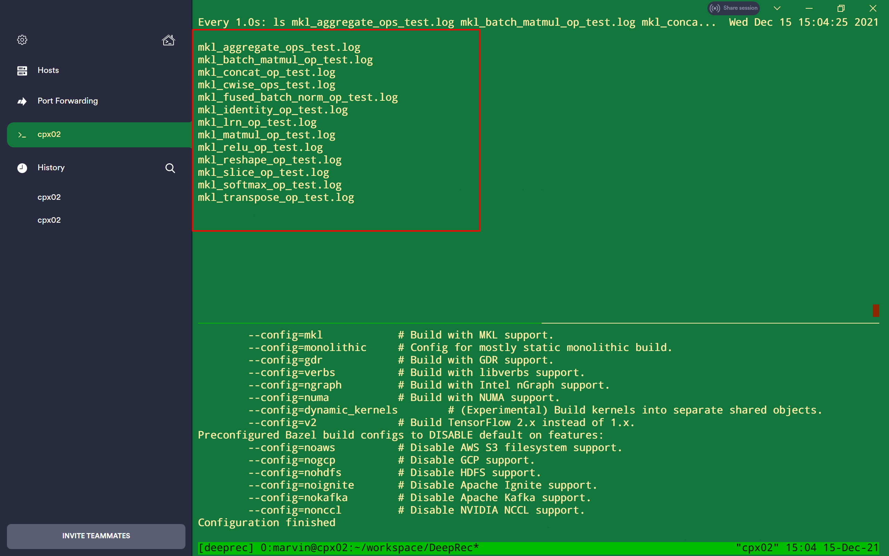

## Prepare test environment
> WIP

## Test targets 

### Running the follow command to get Ops data perfs.
``` shell
CI_DOCKER_EXTRA_PARAMS=-it ./ci_build bazel_build BM
```

## Collect test data
### Got the system config in your test device.
After running the test script, it will show the details for a while.


### Organize the Ops perf data in each file


## Show the Results
Here is one sample file, which you can follow to show the perf results.

> [DeepRec-Ops-Perf-demo.xlsx](../docs/DeepRec-Ops-Perf-demo.xlsx)
